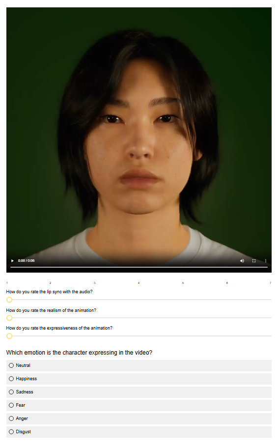

## **Deploying Speech-Driven 3D Facial Animation in Unreal Engine for Production-Ready Digital Humans**
Repository to host the project website for the paper:

> **Deploying Speech-Driven 3D Facial Animation in Unreal Engine for Production-Ready Digital Humans**
>
>**Accepted and presented at the [ACM SIGGRAPH 2026 Posters Program](https://s2026.siggraph.org/program/posters/)**
>
> <a href='https://uuembodiedsocialai.github.io/AutoFaceARKit/'></a>
> <a href='https://arxiv.org/abs/2606.10753'></a> 
> <a href='https://doi.org/10.1145/3799825.3818695'></a> 
> <a href='https://uuembodiedsocialai.github.io/AutoFaceARKit/#video_demo'></a> 
> 
> Speech-driven 3D facial animation research has shown promising results, but most methods rely on representations that are not compatible with production pipelines. In this work, we present a deployable system that bridges this gap by enabling speech-driven 3D facial animation directly in Unreal Engine (UE) using ARKit-compatible representations. We construct the 3DMEAD-ARKit dataset by converting the MEAD corpus into blendshape sequences using MediaPipe, and retrain FaceDiffuser and ProbTalk3D-X to generate stochastic and emotion-controllable animations. We further develop a modular UE plugin with a Python backend that supports model selection and parameter control. We compare our results to two existing commercial tools: Epic Games’ MetaHuman speech-driven animator and NVIDIA Audio2Face with a perceptual user study. The results highlight the importance of comparisons among academic and commercial pipelines.

## **Dataset Processing Pipeline**
<p align="center">


</p>
<p align="center">
<strong>Dataset processing pipeline.</strong> From left to right: Original MEAD video frame, MediaPipe facial landmark tracking, and the resulting ground-truth animation rendered onto an ARKit-compatible digital human.
</p>

## **System Architecture Overview**
<p align="center">

</p>
<p align="center">
<strong>System overview.</strong> (1) In the frontend interface, the user can select the model, input audio (existing or live recording), conditioning style (i.e., speaking style, emotion, intensity), and a digital human character. (2) The data is passed to the backend process for generating the animation data. (3) After the inference, the data is sent to the engine which is used to create, apply to the selected character, and save the animations in the animation library, allowing the user to also retarget the saved animations to other compatible characters.
</p>

## **Perceptual User Study Evaluation**
<p align="center">

</p>
<p align="center">
<strong>Questionnaire layout.</strong> Interface and survey layout presented to participants during the evaluation. This template displays the full setup used for Experiment 1, which included the emotion recognition task. For Experiment 2, the setup was identical but the final emotion classification question was omitted.
</p>

## Citation ## 
If you find our contribution useful for your work, please consider citing our paper:
```
@inproceedings{ABusacchi26_ueplugin,
        author = {Busacchi, Alessandro and Haque, Kazi Injamamul and Yumak, Zerrin},
        title = {Deploying Speech-Driven 3D Facial Animation in Unreal Engine for Production-Ready Digital Humans},
        booktitle = {Special Interest Group on Computer Graphics and Interactive Techniques Conference Posters (SIGGRAPH Posters '26), July 19--23, 2026, Los Angeles, CA, USA},
        year = {2026},
        location = {Los Angeles, CA, USA},
        numpages = {3},
        url = {[https://doi.org/10.1145/3799825.3818695](https://doi.org/10.1145/3799825.3818695)},
        doi = {10.1145/3799825.3818695},
        publisher = {ACM},
        address = {New York, NY, USA}
}
